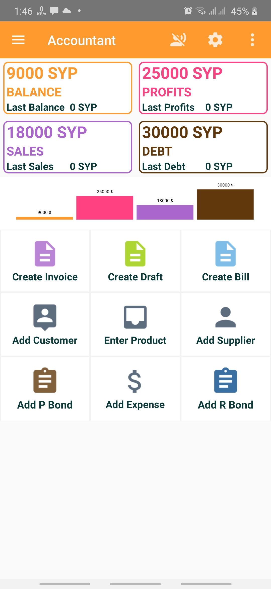
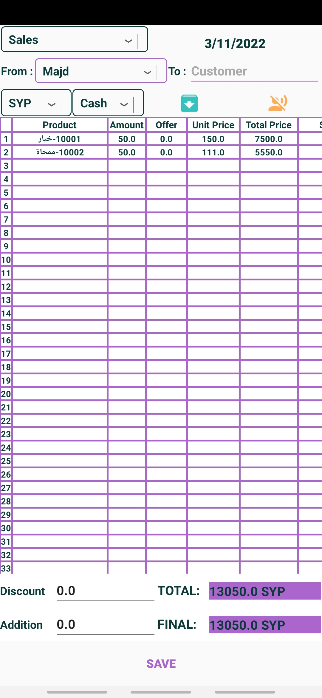
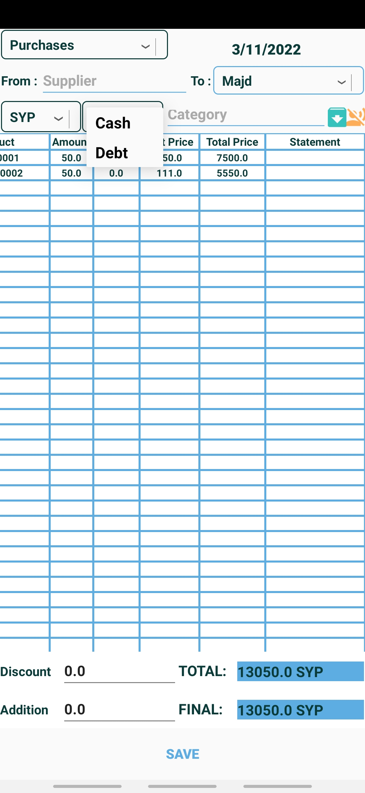
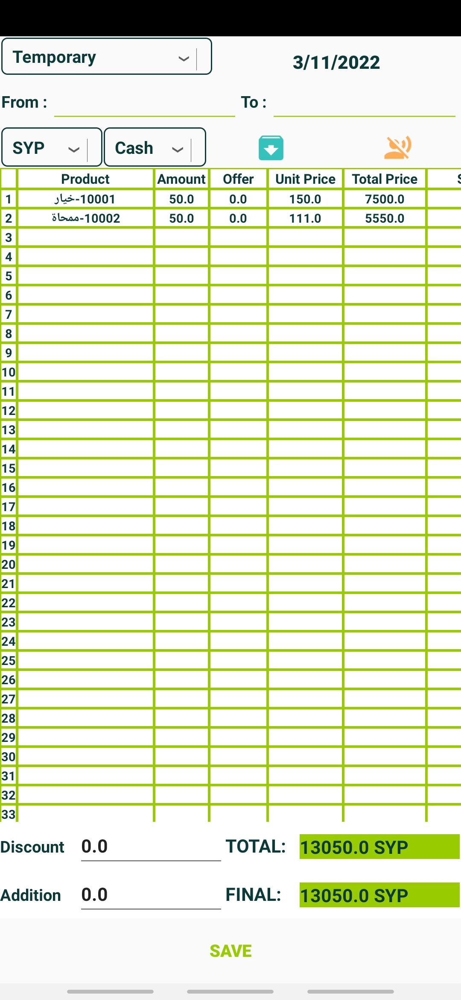
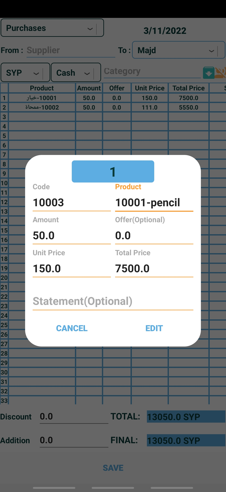
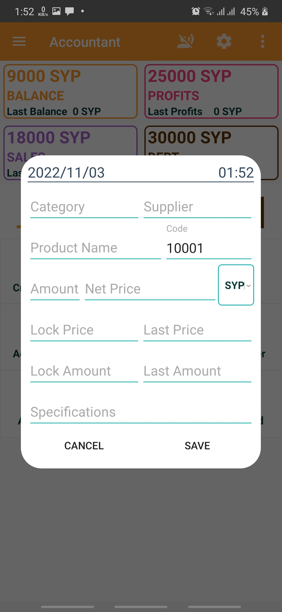

# Accountant
An android application for accounting services which allows you to create invoice, purchase, and draft bills with easy technics and voice field filling service.

#### Compatible with **API Level 21** and higher

### What's included 🚀
- **the smart voice service for managing and editing fields**
- **with correcting voices as much as possible to fill**
- **the easiest and simplest way for accounting**
- create & edit purchase, invoice, and draft bills in cash or debt type
- create & edit customers and suppliers
- create & edit products and categories
- create & edit payment, receipt, and journal bonds
- local SQL database for saving all data
- local authentication with login, register and forget password
- smart search in pages

### Newer Features 🧬
- support two languages arabic and english
- add voice service for open pages
- add multi currencies

## Some Screenshots 🎉

Home             |  Invoice Bill Editor
:-------------------------:|:-------------------------:
  |  
Purchase Bill Editor             |  Draft Bill Editor
  |  
Add & Edit Rows             |  Add A Supplier
  |  

